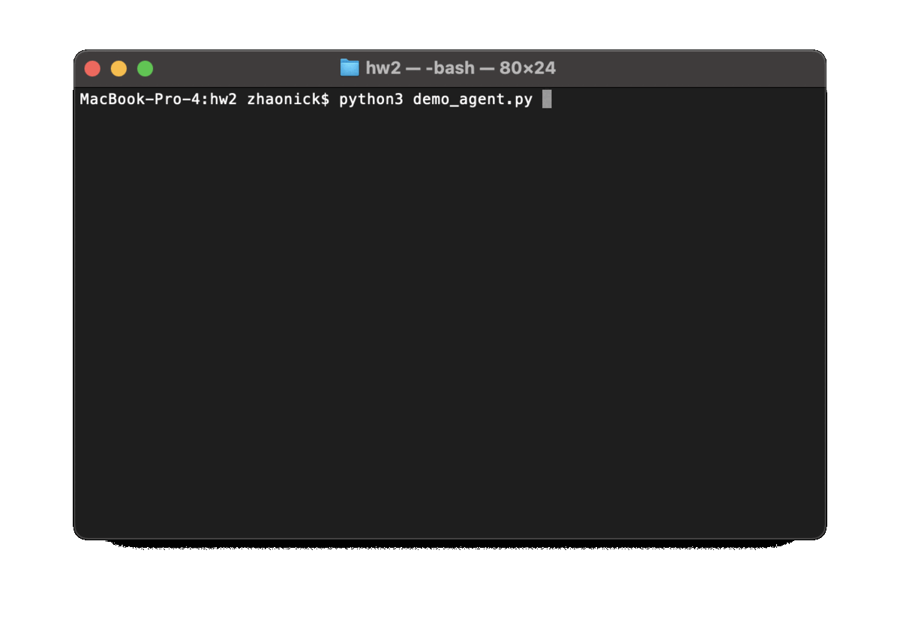

## demo

- alpha-beta tree search with limited depth
- shallower search towards the start due to large branching factor and moves being relatively insignificant
- evalaluation function:
  - take center while keeping pieces close
  - trade when at advantage
  - leave 2 pieces to defend king row
- `calibrate.py` records how much time taken at each alpha-beta search depth on host machine; used to decide search depth when playing
